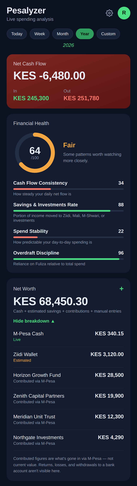
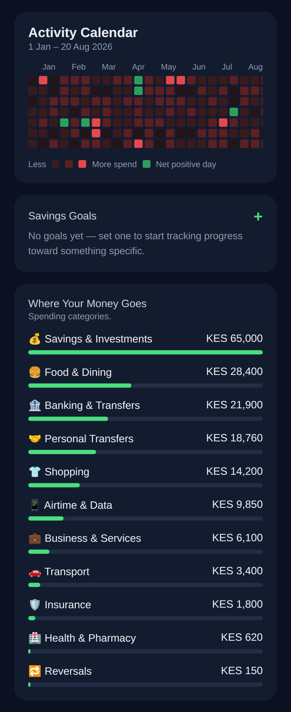
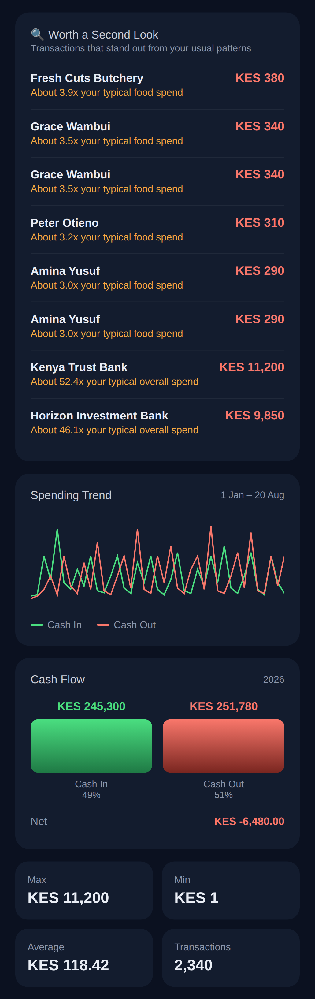
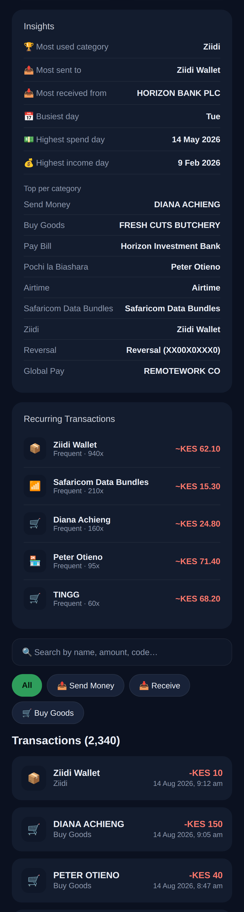
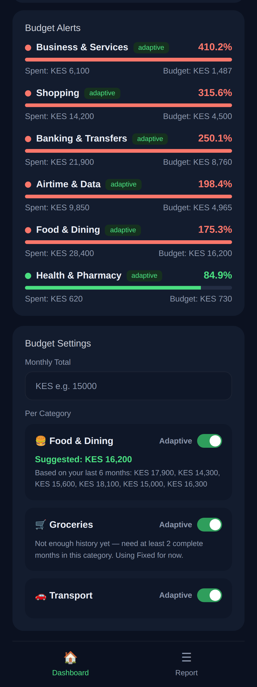
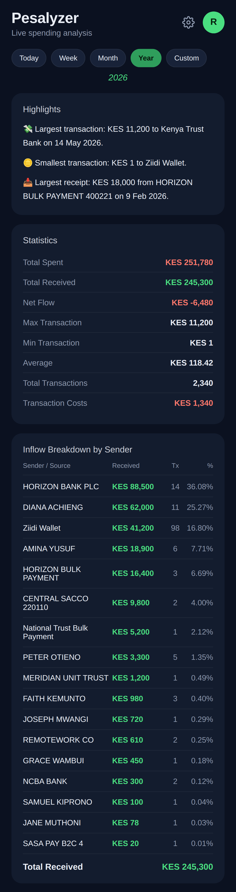
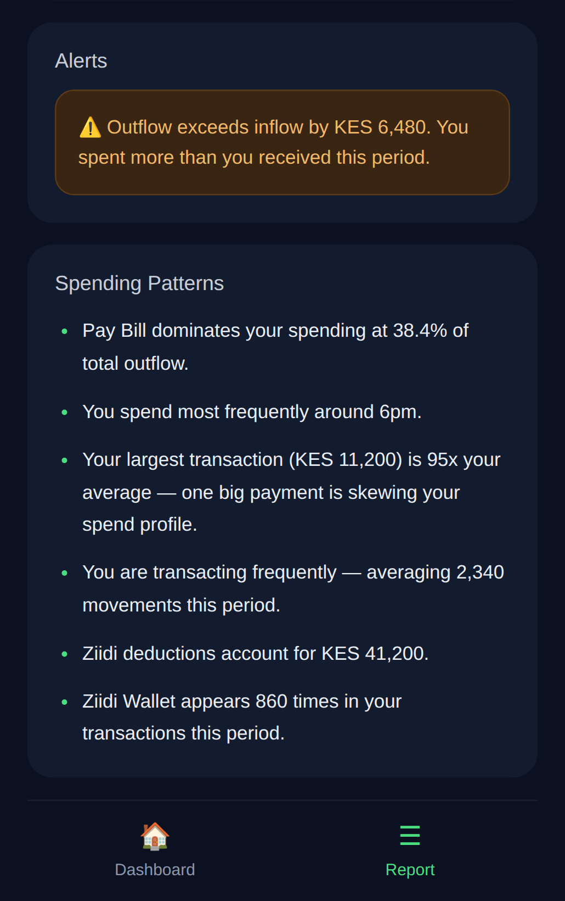

# Pesalyzer

**Turn a flood of M-Pesa texts into a clear picture of where the money goes.**

Every M-Pesa transaction already lands as an SMS. Pesalyzer reads those messages the moment they arrive, turns them into structured records, and builds a full financial picture around them — budgets, net worth, forecasts, and the occasional catch when something doesn't add up. All of it stays on the device.

## Screenshots

 
   
   
   

 
   
   

 
   
   

## What It Does

### 📥 Capture, automatically
Transactions are picked up the moment the SMS arrives — no manual entry. Every major M-Pesa message type is recognized: send and receive money, Buy Goods, Pay Bill, Pochi la Biashara, withdrawals, deposits, airtime, Safaricom data bundles, Ziidi, Mali, M-Shwari, Fuliza, reversals, KCB M-Pesa, GlobalPay, Lipa Mdogo Mdogo, and charity payments. Running two SIMs? Choose which lines to track, with a diagnostics view for when something looks off.

### 🏷️ Understand where it goes
Every transaction lands in one of 20+ categories — food, transport, rent, betting, savings, loans, and more — sorted by an offline merchant dictionary, no internet required. A spending heatmap and category breakdown make the patterns obvious at a glance.

### 💰 Manage it, not just track it
Net worth is calculated automatically and can be topped up with manually entered assets and liabilities. Savings goals track contributions over time, and an adaptive budgeting engine adjusts its suggestions to actual behavior instead of sticking to a fixed plan.

### 🔮 See what's coming
A spend forecast engine projects near-term spending with a confidence rating — low, medium, or high — and a financial health score rolls several signals into one number worth checking in on.

### 🚨 Catch what's off
Statistical anomaly detection flags spending that breaks from the norm, surfacing alerts before small issues become expensive ones.

### 🔐 Locked down
Biometric authentication guards access to the app, and a short onboarding flow handles first-launch setup.

## Under the Hood

- Kotlin, Jetpack Compose, Material 3
- Room (SQLite) for on-device storage
- AndroidX Biometric
- Kotlin Coroutines, Lifecycle ViewModel (Compose)
- Min SDK 26, target/compile SDK 37

## Getting Started

1. Clone the repository
2. Open in Android Studio
3. Build and run on a device or emulator with SMS and biometric permissions granted
